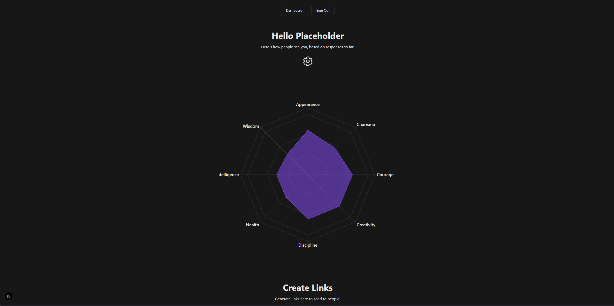
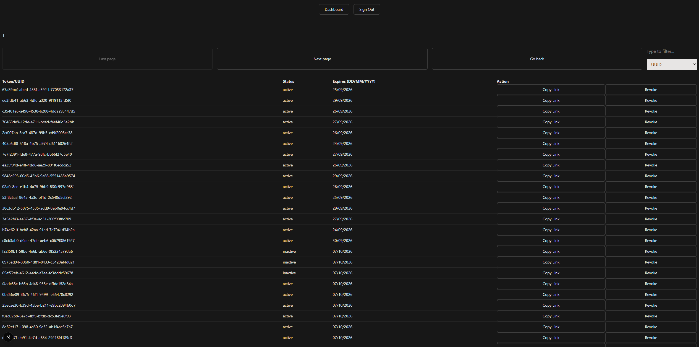
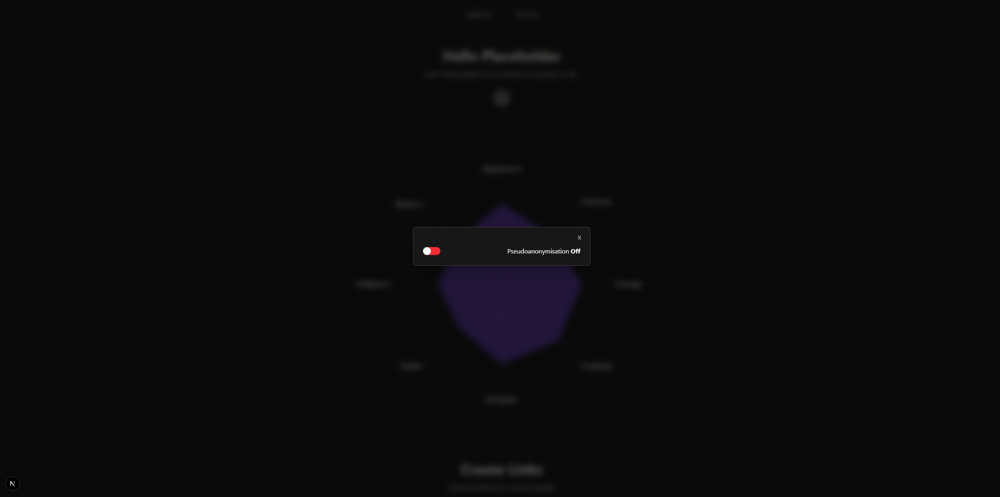
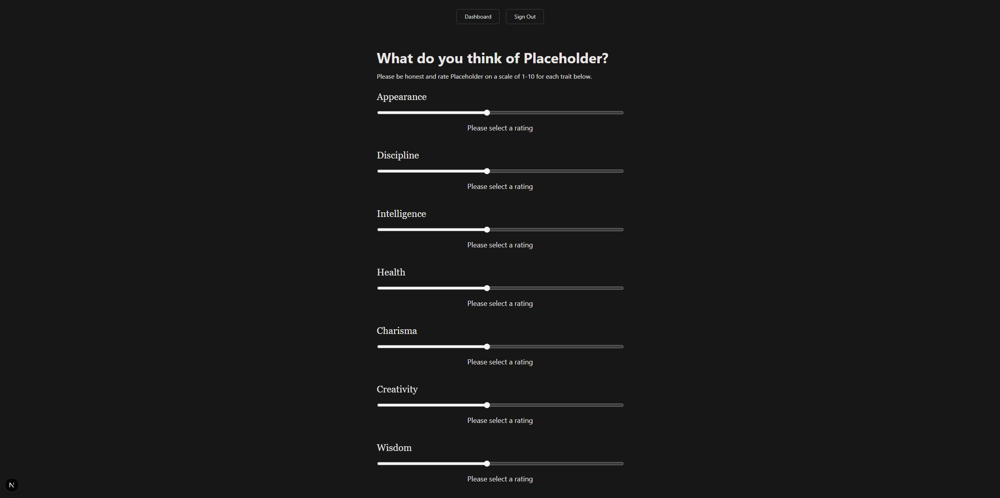
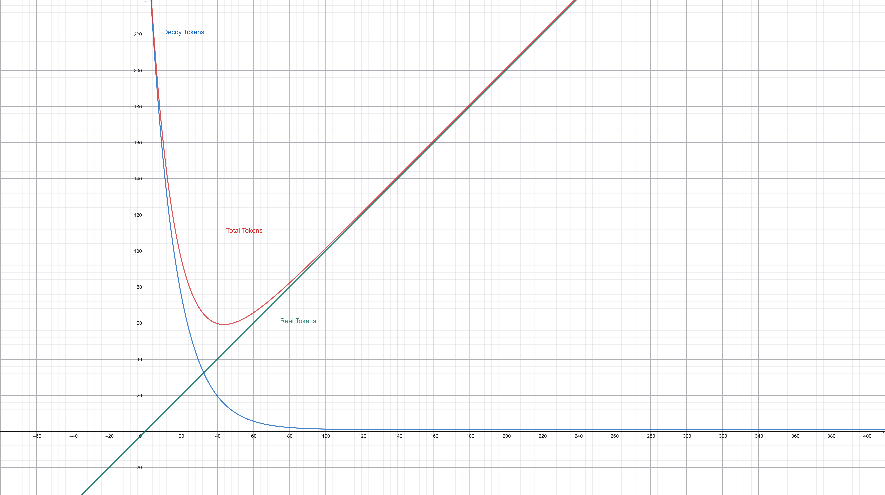
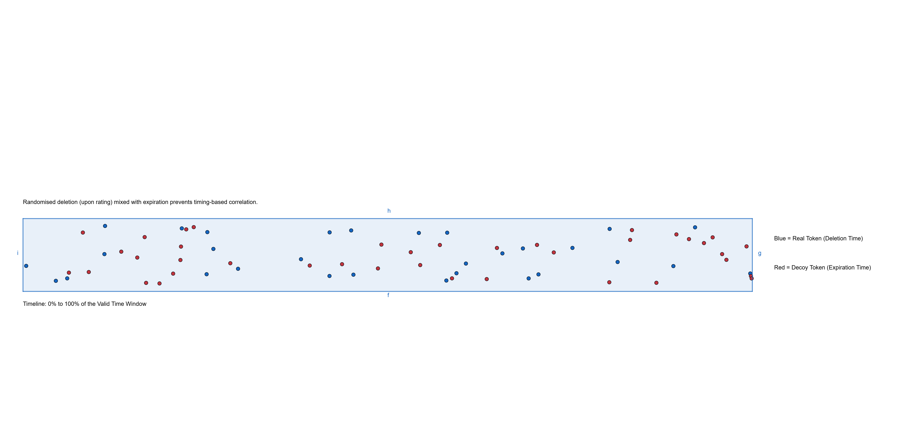
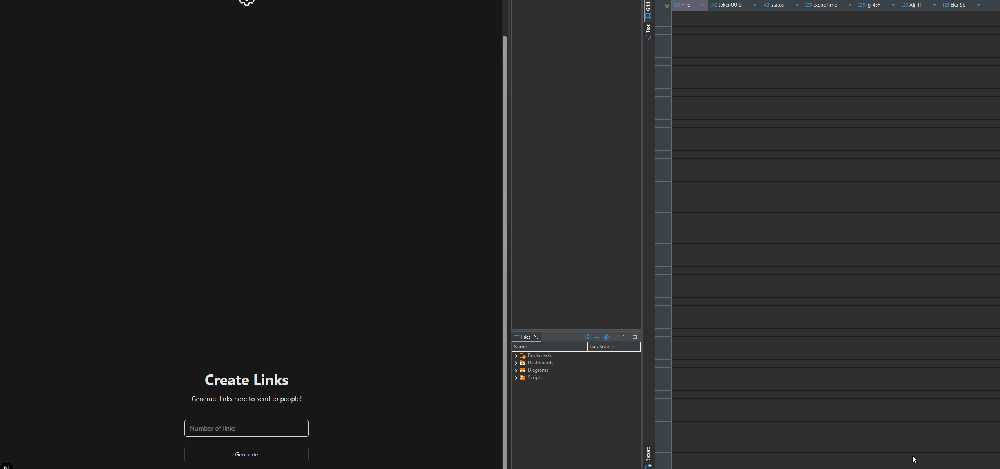
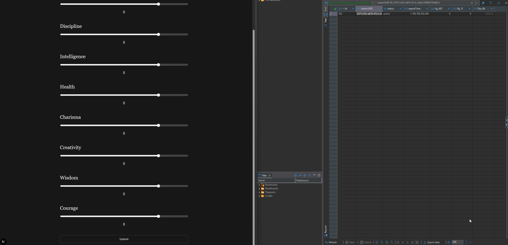

# Kaleistats

<table>
  <tr>
    <td></td>
    <td></td>
  </tr>
  <tr>
    <td></td>
    <td></td>
  </tr>
</table>

Kaleistats is a Next.js full-stack web app designed to collect and visualise feedback on one's own character traits. It utilises token-based architecture.

## Features

- **Trait & Stats System**
  - Allows users to specify their own traits and ask others to rate them, visualising the results in a video-game-inspired format using a radar chart
- **Token System**
  - Generates single-use rating links (`tokenUUID`) for feedback submission
- **Analytics Dashboard**
  - Displays aggregated feedback and average trait ratings using Radar Charts
- **Token Management**
  - Provides filtering, revoking and searching (pagination) for active, used and decoy tokens
- **Authentication**
  - Login and registration functionality for dashboard access

## Privacy & Pseudo-anonymisation

The pseudo-anonymisation setting mitigates casual timing-based correlation, such as an admin attempting to link a submitted rating to a specific person by observing token usage or deletion timestamps. It relies on data flooding, delayed execution of various time-based events and simple database obfuscation

- **Decoy Token Flooding**
  - When a batch of valid rating tokens is generated, the system simultaneously generates a pool of decoy tokens
- **Token Shuffling**
  - Before the generated batch is finalised, real and decoy tokens are randomised using the Fisher-Yates algorithm (`src/lib/shuffleArray.ts`) to prevent identification based on sequential order
- **Randomised Expiration**
  - Tokens (real and decoy) are assigned a randomised, non-deterministic expiration timestamp (`tokenExpireTime`) 8 hours to 8 days in the future. This contrasts with the default deterministic expiration timestamp used when pseudo-anonymisation is off
- **Decoupled & Randomised Deletion**
  - Randomised deletion and expiration times prevent timing-based correlation. Upon rating submission, the system flags the token as used (`Alj_1f = 1`) and assigns it a randomised non-deterministic future deletion timestamp (`Eka_9b`) rather than executing an immediate deletion
- **Database Obfuscation**
  - The SQLite database uses non-descriptive column names (`fg_43F`, `Alj_1f`, `Eka_9b`) to obscure data during casual database browsing

**Note on threat model:** This architecture is a deterrent against dashboard/casual-level monitoring. It is not a cryptographic boundary and does not protect against an admin who reads the source code or executes direct SQL queries to filter out decoys. By nature of one admin, it is trust based to a large extent

Technical implementation can be observed in `src/lib/submitRating.ts`

## Scaling Model

The system uses an exponential decay function to determine the volume of decoy tokens based on usage volume, assuming use of default constants:

```ts
const CEILING = 300;
const HALF_LIFE = 10; // Drops by 50% every 10 users
const lambda = Math.log(2) / HALF_LIFE;

const numDecoys = Math.round(CEILING * Math.pow(Math.E, -lambda * amount)) + 1;
```

Or expressed in Latex:

$$\text{numDecoys} = \text{round}\left(300 \cdot e^{-\left(\frac{\ln(2)}{10}\right) \cdot x}\right) + 1$$



- **decoys(x) (blue)**
  - When real token generation ($x$) is low, the database generates up to 300 decoys
- **real(x) (green)**
  - Real tokens scale up linearly
- **total tokens(x) (red)**
  - The sum of decoy and real tokens. As real token volume increases, the proportion of synthetic noise (decoys) decreases



- **Timeline Overlap**
  - Blue points mark real token deletions (upon rating). Red points mark decoy expirations, both of which are assigned randomised timestamps drawn from the same window (by default, 8 hours to 8 days after the event). Real token expirations are omitted here for readability

## Practical Demonstration





## Tech Stack

- Next.js (Typescript)
- SQLite (better-sqlite3)
- Better Auth
- Recharts
- TailwindCSS
- React Hot Toast

## Getting started

1. Clone the repo

```bash
git clone https://github.com/funcnroll/kaleistats.git
cd kaleistats
```

2. Install dependencies

```bash
npm i
```

3. Fill out and configure local variables

```bash
cp .env.example .env
```

```bash
vim config/configClient.js
```

```bash
vim config/sharedConfig.js
```

4. Initialise the DB

```bash
npm run initDb
```

5. Start the server

```bash
npm run dev
```

**Note:** You do not need to enter a real email for registration. It is a technical requirement by better auth. Usernames are unfortunately not possible as of now.

## License

This project is licensed under the [MIT License](LICENSE.md).
